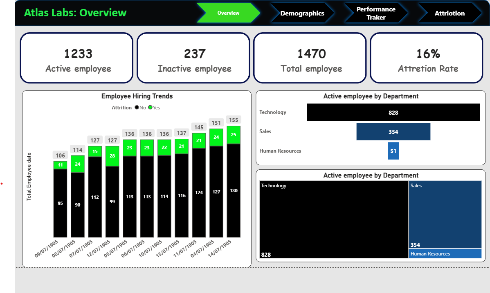
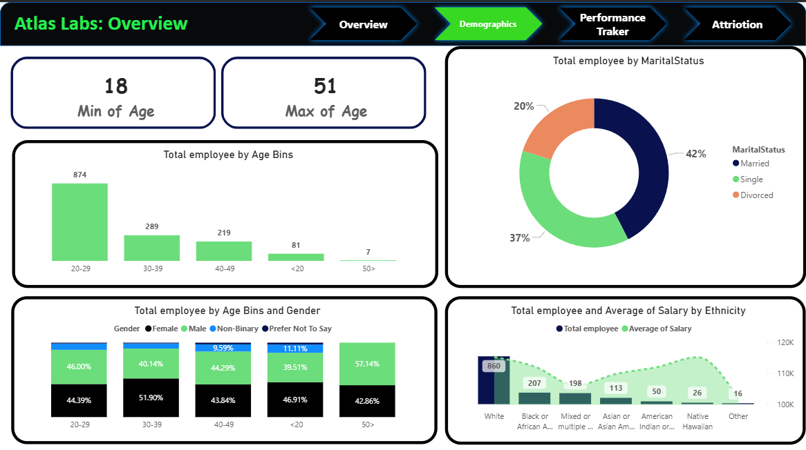
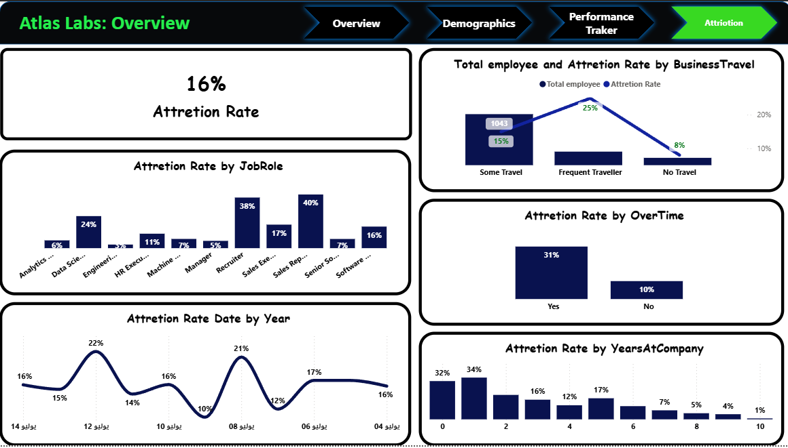

# 📊 Atlas Labs - HR Analytics Comprehensive Dashboard

## 🌟 Executive Summary
This repository contains the complete HR Analytics solution for **Atlas Labs**. The dashboard is designed to provide a 360-degree view of the workforce, tracking everything from high-level attrition to individual employee performance and demographic diversity.

---

## 🖼️ Dashboard Preview

### 1. Overview Page
*Global metrics: Headcount, Attrition Rate, and Departmental distribution.*

### 2. Demographics Analysis
*Deep dive into age, gender, marital status, and ethnicity.*

### 3. Attrition Insights
*Identifying the "Why" and "Who" behind employee turnover.*

### 4. Performance Tracker
*Monitoring employee satisfaction, ratings, and career progression.*

---

## 🔍 Detailed Insights

### 📉 Attrition & Retention
* **Attrition Rate:** **16%** total turnover.
* **Burnout Alert:** Employees working **Overtime** have a **31%** attrition rate, which is significantly higher than non-overtime staff (10%).
* **Critical Roles:** Sales Representatives and Recruiters are the most likely to leave, with turnover rates reaching **40%**.
* **Tenure Risk:** 34% of exits occur within the **first year** of employment.

### 👥 Diversity & Demographics
* **Workforce Age:** Primarily between **18 and 51 years old**.
* **Marital Status:** 42% of the workforce is married.
* **Ethnicity:** Diverse representation across White, Black/African American, Asian, and Hispanic cohorts.

### 🎭 Performance & Satisfaction
* The dashboard tracks **Self-Rating** vs. **Manager Rating**.
* Monitoring **Environment Satisfaction** and **Job Involvement** to predict future exits.

---

## 🛠️ Technical Stack
* **Platform:** Power BI Desktop.
* **Data Model:** Star Schema with dedicated Fact and Dimension tables.
* **Customization:** Custom JSON theme (`CY26SU02.json`) for Atlas Labs branding.

---

## 🚀 Setup Instructions
1.  **Upload Images:** Ensure `OverView.png`, `Demographics.png`, `Attriotion.png`, and `Performance Traker.png` are uploaded to your GitHub repository.
2.  **Open Report:** Open the `.pbix` file to interact with the filters (Department, Job Role, etc.).
3.  **Analyze:** Use the navigation buttons in the dashboard header to switch between the four main views.

---
*Developed for the Atlas Labs HR Strategic Planning Team.*
